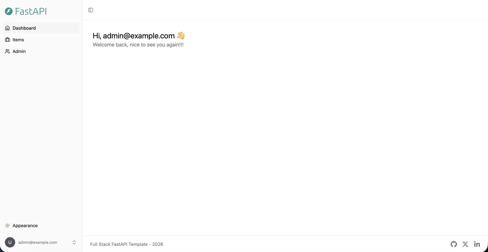
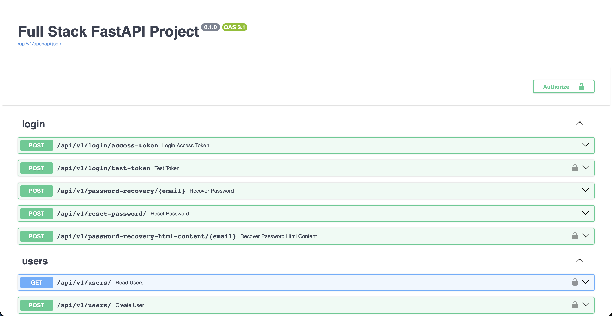
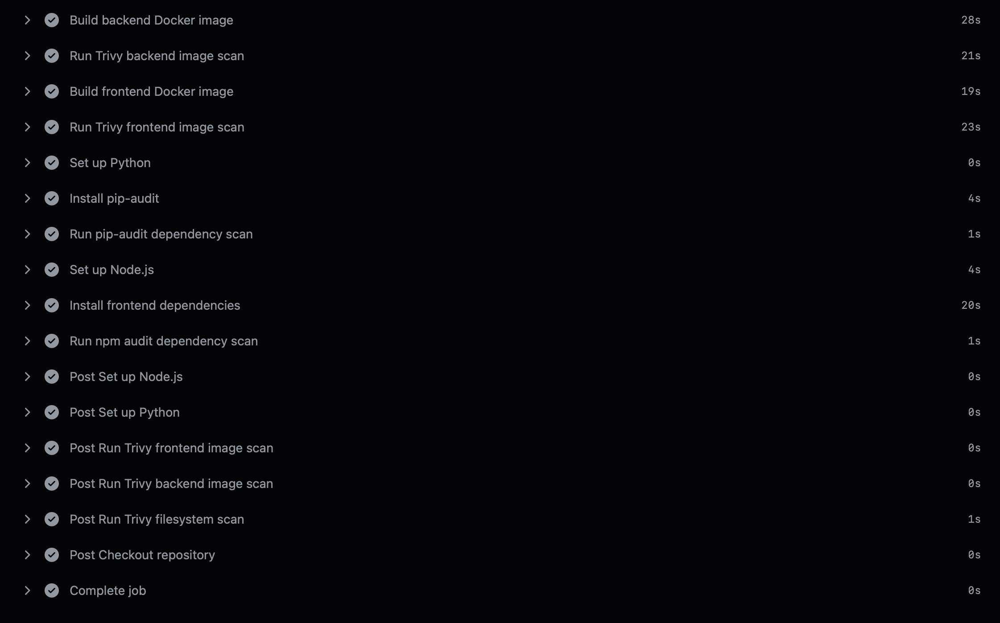
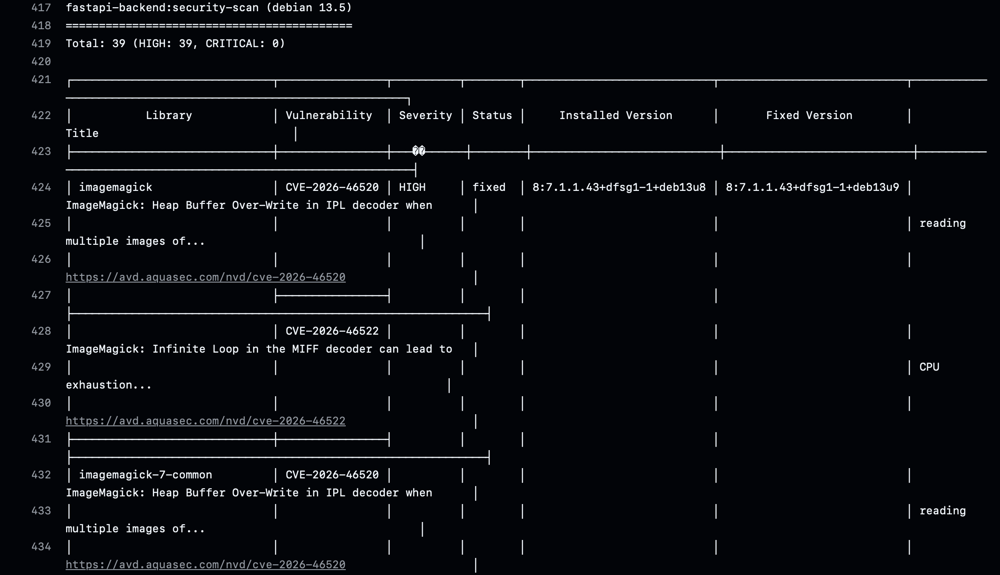
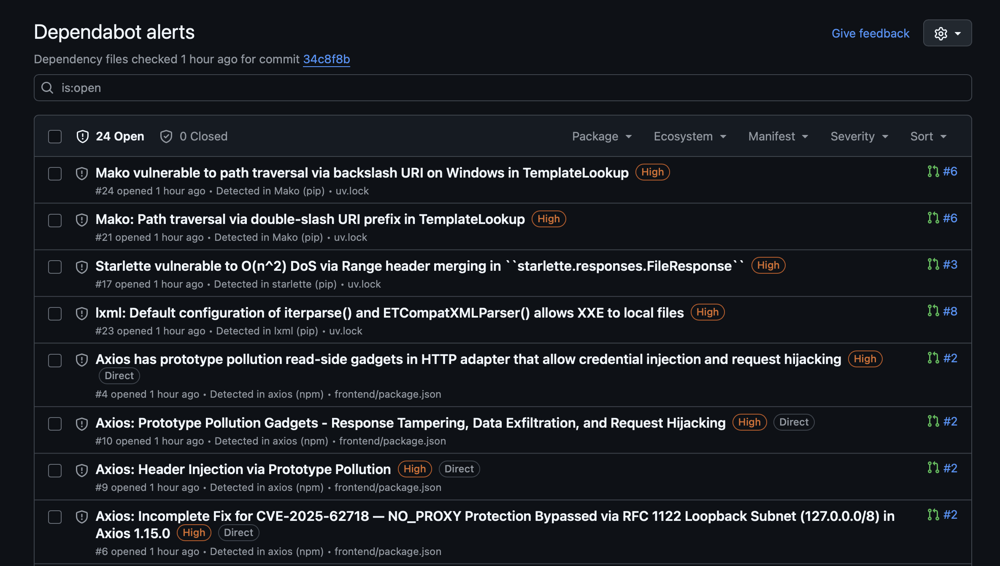
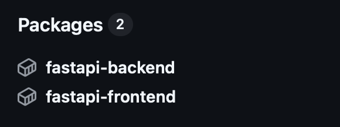
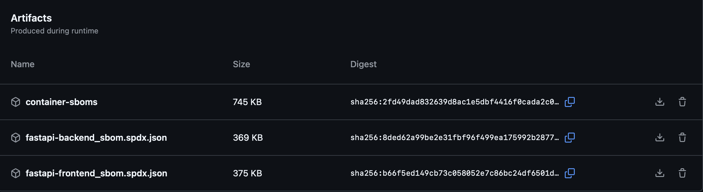
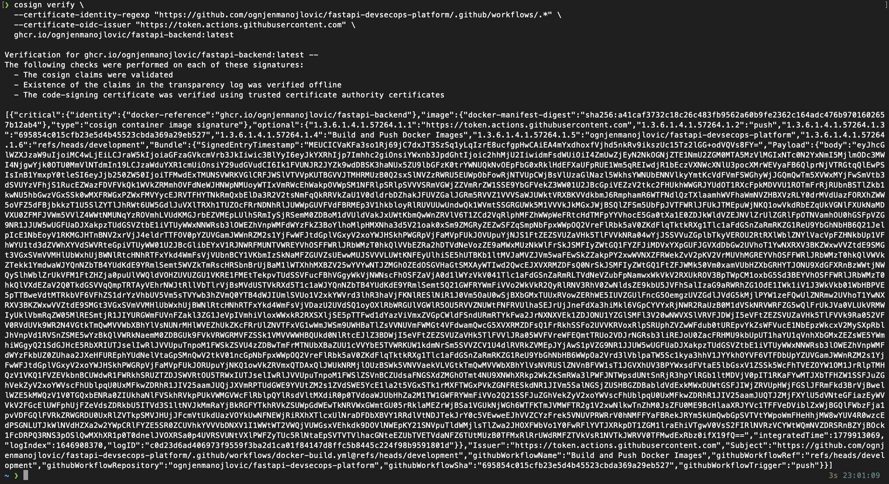

# FastAPI DevSecOps Platform

<p align="center">
  
</p>

> A modern DevSecOps showcase project based on the official **FastAPI Full Stack Template**, focused on secure CI/CD, automated security scanning, container hardening, software supply chain security, SBOM generation, GitHub Container Registry, and signed Docker images.

---

## Table of Contents

- [Overview](#overview)
- [Original Application Template](#original-application-template)
- [Project Goal](#project-goal)
- [Why This Project Exists](#why-this-project-exists)
- [High-Level Architecture](#high-level-architecture)
- [Technology Stack](#technology-stack)
- [What the Base Application Does](#what-the-base-application-does)
- [DevSecOps Features Implemented](#devsecops-features-implemented)
  - [1. GitHub Actions CI/CD](#1-github-actions-cicd)
  - [2. Secret Scanning with Gitleaks](#2-secret-scanning-with-gitleaks)
  - [3. Static Application Security Testing with Semgrep](#3-static-application-security-testing-with-semgrep)
  - [4. Vulnerability Scanning with Trivy](#4-vulnerability-scanning-with-trivy)
  - [5. Dependency Scanning with pip-audit and npm audit](#5-dependency-scanning-with-pip-audit-and-npm-audit)
  - [6. Dependabot Security Monitoring](#6-dependabot-security-monitoring)
  - [7. Docker Image Builds and GitHub Container Registry](#7-docker-image-builds-and-github-container-registry)
  - [8. Docker Container Hardening](#8-docker-container-hardening)
  - [9. SBOM Generation](#9-sbom-generation)
  - [10. GitHub Security Tab Integration](#10-github-security-tab-integration)
  - [11. Container Image Signing with Cosign](#11-container-image-signing-with-cosign)
  - [12. Pre-Commit and Workflow Security Checks](#12-pre-commit-and-workflow-security-checks)
- [Docker Hardening Explained](#docker-hardening-explained)
- [CI/CD Workflow Overview](#cicd-workflow-overview)
- [Security Pipeline Overview](#security-pipeline-overview)
- [Supply Chain Security Overview](#supply-chain-security-overview)
- [Local Setup](#local-setup)
- [Useful Commands](#useful-commands)
- [Screenshots](#screenshots)
- [What I Learned](#what-i-learned)
- [Possible Future Improvements](#possible-future-improvements)
- [Conclusion](#conclusion)

---

## Overview

This project demonstrates how a modern fullstack web application can be secured and automated using DevSecOps practices.

The application itself is based on the official **FastAPI Full Stack Template**, which already provides a realistic fullstack setup with a backend, frontend, database, Docker, and GitHub Actions. Instead of focusing on writing a new application from scratch, this project focuses on building a professional DevSecOps layer around an existing application.

The main goal was to simulate a realistic engineering workflow where an existing application is containerized, scanned, hardened, monitored for dependency risks, built through CI/CD pipelines, pushed to a container registry, documented through SBOMs, and signed for supply chain security.

---

## Original Application Template

This project is based on the official FastAPI Full Stack Template:

- Original repository: [fastapi/full-stack-fastapi-template](https://github.com/fastapi/full-stack-fastapi-template)
- Official documentation: [FastAPI Project Generation](https://fastapi.tiangolo.com/project-generation/)

The original template provides a modern fullstack application with:

- FastAPI backend
- React frontend
- TypeScript
- SQLModel
- PostgreSQL
- Docker
- Docker Compose
- GitHub Actions
- Traefik
- Automatic HTTPS support
- API documentation
- Authentication and user management

This project uses the template as a realistic application base and extends it with additional DevSecOps and security engineering practices.

---

## Project Goal

The goal of this project was not to build a new web application from scratch.

The goal was to answer this question:

> How can an existing fullstack application be secured, automated, scanned, hardened, and prepared for modern DevSecOps workflows?

This is close to real-world DevSecOps work. DevSecOps Engineers do not create every application from zero. Instead, they secure existing applications, improve CI/CD pipelines, reduce risk, automate scans, harden infrastructure, and improve software supply chain visibility.

---

## Why This Project Exists

A normal Docker project usually stops at:

```text
docker compose up
```

This project goes further.

It includes:

- Automated CI/CD pipelines
- Secret scanning
- SAST scanning
- Dependency scanning
- Container image scanning
- Docker hardening
- SBOM generation
- GitHub Security integration
- Dependabot alerts
- GitHub Container Registry
- Signed container images
- Supply chain security concepts

The goal was to turn a regular fullstack application into a DevSecOps-focused platform.

---

## High-Level Architecture

```text
Developer
   |
   | git push
   v
GitHub Repository
   |
   | GitHub Actions
   v
Security Pipeline
   |-- Gitleaks
   |-- Semgrep
   |-- Trivy
   |-- pip-audit
   |-- npm audit
   |
   v
Docker Build Pipeline
   |-- Build backend image
   |-- Build frontend image
   |
   v
GitHub Container Registry
   |-- ghcr.io/<user>/fastapi-backend
   |-- ghcr.io/<user>/fastapi-frontend
   |
   v
Cosign Image Signing
   |
   v
Signed and traceable container images
```

The local application stack runs with Docker Compose:

```text
Frontend Container
   |
   v
Backend API Container
   |
   v
PostgreSQL Database Container
```

---

## Technology Stack

### Application Stack

| Component | Technology |
|---|---|
| Backend | FastAPI |
| Backend Language | Python |
| Frontend | React |
| Frontend Language | TypeScript |
| Database | PostgreSQL |
| ORM / Data Layer | SQLModel |
| API Docs | OpenAPI / Swagger |
| Containerization | Docker |
| Local Orchestration | Docker Compose |
| Reverse Proxy Support | Traefik |

### DevSecOps Stack

| Area | Tool |
|---|---|
| CI/CD | GitHub Actions |
| Secret Scanning | Gitleaks |
| SAST | Semgrep |
| Container Scanning | Trivy |
| Filesystem Scanning | Trivy |
| Backend Dependency Scanning | pip-audit |
| Frontend Dependency Scanning | npm audit |
| Dependency Monitoring | Dependabot |
| Registry | GitHub Container Registry |
| SBOM Generation | Anchore SBOM Action / Syft |
| Image Signing | Cosign / Sigstore |
| Workflow Security | zizmor |
| Pre-Commit Quality Checks | pre-commit / prek |
| Python Linting | Ruff |
| Type Checking | mypy / ty |
| Frontend Linting | Biome |

---

## What the Base Application Does

The base application is a modern fullstack web platform.

In simple terms, it provides:

- A frontend dashboard
- A FastAPI backend
- User authentication
- User management
- API endpoints
- PostgreSQL database integration
- Interactive API documentation

The application follows a common real-world architecture:

```text
React Frontend
   |
   | HTTP/API requests
   v
FastAPI Backend
   |
   | SQL queries / ORM
   v
PostgreSQL Database
```

The API documentation is available through Swagger/OpenAPI. This allows developers to test API endpoints directly in the browser.

---

# DevSecOps Features Implemented

## 1. GitHub Actions CI/CD

GitHub Actions is used to automate the project workflow.

Instead of manually running security tools, building Docker images, and pushing them to a registry, GitHub Actions performs these tasks automatically when code is pushed.

Implemented workflows include:

- Security scanning workflow
- Docker build and push workflow
- SBOM generation workflow
- Existing template workflows for tests, pre-commit, Docker Compose validation, and workflow security checks

Why this matters:

- Reduces manual work
- Makes results reproducible
- Finds problems earlier
- Creates a professional CI/CD process
- Integrates security into development

This is one of the core principles of DevSecOps: security should run automatically as part of the development process.

---

## 2. Secret Scanning with Gitleaks

Gitleaks is used to detect accidentally committed secrets.

It scans the repository for sensitive data such as:

- API keys
- Passwords
- Tokens
- Private keys
- Credentials
- Hardcoded secrets

Why this matters:

One of the most common security mistakes is accidentally committing secrets into a Git repository. Once a secret is pushed, it can be exposed, copied, or abused.

Gitleaks helps prevent this by scanning the codebase automatically.

Example of what Gitleaks is meant to catch:

```env
AWS_SECRET_ACCESS_KEY=example-secret-key
DATABASE_PASSWORD=supersecret
PRIVATE_KEY=...
```

In this project, Gitleaks runs automatically in the security workflow.

---

## 3. Static Application Security Testing with Semgrep

Semgrep is used for Static Application Security Testing.

SAST means the code is scanned without running the application.

Semgrep can detect risky code patterns such as:

- SQL injection patterns
- Command injection risks
- Unsafe input handling
- Insecure configuration
- Dangerous function usage
- Hardcoded credentials
- Weak security practices

Why this matters:

Semgrep helps find security issues early, before code reaches production.

This is important because fixing issues earlier is usually easier and cheaper than fixing them after deployment.

In this project, Semgrep is integrated into the GitHub Actions security workflow.

Semgrep results are also exported as SARIF and uploaded to GitHub Code Scanning, so findings can be viewed in the GitHub Security tab.

---

## 4. Vulnerability Scanning with Trivy

Trivy is used to scan for known vulnerabilities.

It is used in multiple ways:

### Filesystem Scan

The repository is scanned for vulnerabilities and misconfigurations.

### Backend Image Scan

The backend Docker image is built and scanned.

### Frontend Image Scan

The frontend Docker image is built and scanned.

Why this matters:

A container image contains more than application code. It also includes:

- OS packages
- Python packages
- Node packages
- system libraries
- base image layers
- runtime dependencies

Even if the application code is clean, the image can still contain vulnerable packages.

Trivy helps detect these issues.

In this project, Trivy found real vulnerabilities in container images and dependencies. Instead of hiding them, the workflow reports them. This reflects a realistic DevSecOps approach: first create visibility, then prioritize and fix.

---

## 5. Dependency Scanning with pip-audit and npm audit

Dependency scanning was added for both backend and frontend.

### Backend

`pip-audit` checks Python dependencies for known vulnerabilities.

### Frontend

`npm audit` checks JavaScript/TypeScript dependencies for known vulnerabilities.

Why this matters:

Modern applications rely heavily on third-party packages. A vulnerability in a dependency can affect the entire application.

Examples of dependency risks:

- vulnerable web framework versions
- insecure HTTP clients
- prototype pollution in JavaScript packages
- vulnerable template engines
- path traversal in package utilities

Dependency scanning helps identify these risks automatically.

The scans are configured to continue on error in the pipeline. This means the findings are visible, but the pipeline does not immediately block development. This is useful during the early hardening phase of a project.

---

## 6. Dependabot Security Monitoring

Dependabot is enabled for automatic dependency monitoring.

The repository already contains a professional Dependabot configuration for:

- GitHub Actions
- Python/uv dependencies
- Bun/frontend dependencies
- Docker images
- Docker Compose
- pre-commit hooks

Dependabot alerts were also enabled in GitHub Security settings.

Why this matters:

Dependabot continuously checks dependencies against known vulnerability databases and can create alerts or pull requests when vulnerable versions are found.

Dependabot does not replace Semgrep, Trivy, or Gitleaks.

Each tool has a different role:

| Tool | Purpose |
|---|---|
| Dependabot | Monitors dependencies and creates update alerts |
| Semgrep | Scans source code for insecure patterns |
| Trivy | Scans containers and filesystems for vulnerabilities |
| Gitleaks | Detects committed secrets |
| pip-audit | Audits Python dependencies |
| npm audit | Audits frontend dependencies |

Together, they create layered security coverage.

---

## 7. Docker Image Builds and GitHub Container Registry

A dedicated workflow builds backend and frontend Docker images and pushes them to GitHub Container Registry.

The images are pushed as:

```text
ghcr.io/<github-user>/fastapi-backend:latest
ghcr.io/<github-user>/fastapi-frontend:latest
```

Why this matters:

In real CI/CD workflows, applications are usually not built manually on servers.

Instead:

```text
Code push
   |
   v
CI/CD pipeline builds image
   |
   v
Image is pushed to registry
   |
   v
Deployment pulls image from registry
```

GitHub Container Registry acts as a central place to store built Docker images.

Benefits:

- Reproducible builds
- Centralized image storage
- Better version control
- Easier deployment later
- Better supply chain visibility

Even though this project is currently used locally, building and pushing images to GHCR demonstrates a realistic DevSecOps workflow.

---

## 8. Docker Container Hardening

The Docker setup was hardened to reduce risk.

Container hardening was applied in two places:

1. `backend/Dockerfile`
2. `compose.yml`

The goal was to reduce privileges and limit what containers can do at runtime.

Implemented hardening features:

- slim base image
- non-root user
- explicit file ownership
- healthchecks
- read-only filesystem
- no-new-privileges
- dropped Linux capabilities
- tmpfs for temporary writable paths

This is important because containers should not run with more privileges than necessary.

---

## 9. SBOM Generation

SBOM generation was added with a dedicated GitHub Actions workflow.

SBOM means:

> Software Bill of Materials

It is basically an inventory list of what is inside a software artifact or container image.

An SBOM can include:

- operating system packages
- Python packages
- Node packages
- system libraries
- package versions
- metadata about dependencies

Why this matters:

If a new critical vulnerability appears, an SBOM helps answer:

> Are we using the affected package anywhere?

For example, if a new OpenSSL vulnerability is announced, a company can check SBOMs to find which images contain OpenSSL.

This is a key part of modern software supply chain security.

In this project, SBOM files are generated for:

- backend image
- frontend image

They are uploaded as GitHub Actions artifacts.

---

## 10. GitHub Security Tab Integration

Security findings were integrated into GitHub Code Scanning using SARIF uploads.

SARIF is a standard format for static analysis results.

The goal was to make findings visible in:

```text
GitHub Repository → Security → Code scanning alerts
```

Why this matters:

Without SARIF upload, findings are only visible inside workflow logs.

That means a developer would need to:

```text
Actions → Workflow run → Job → Logs → Scroll manually
```

With SARIF upload, findings become centralized in the GitHub Security tab.

Benefits:

- Easier visibility
- Better tracking
- Cleaner security workflow
- More professional presentation
- Better prioritization

This is closer to how security findings are handled in real engineering teams.

---

## 11. Container Image Signing with Cosign

Cosign was added to sign Docker images after they are built and pushed to GHCR.

The build workflow now:

1. builds the backend image
2. pushes the backend image to GHCR
3. signs the backend image with Cosign
4. builds the frontend image
5. pushes the frontend image to GHCR
6. signs the frontend image with Cosign

Cosign uses keyless signing through GitHub Actions OIDC.

This means no long-lived signing key has to be stored manually.

Why this matters:

Image signing answers this question:

> Can I prove that this container image was built by my trusted CI/CD workflow and was not modified?

Cosign helps verify:

- image integrity
- build identity
- GitHub workflow identity
- supply chain trust

This is a modern DevSecOps and cloud-native security practice.

Example verification command:

```bash
cosign verify \
  --certificate-identity-regexp "https://github.com/<github-user>/<repo-name>/.github/workflows/.*" \
  --certificate-oidc-issuer "https://token.actions.githubusercontent.com" \
  ghcr.io/<github-user>/fastapi-backend:latest
```

If verification succeeds, the image signature is valid.

---

## 12. Pre-Commit and Workflow Security Checks

The original template already included a strong pre-commit setup.

The project includes checks such as:

- YAML validation
- TOML validation
- trailing whitespace cleanup
- end-of-file fixes
- frontend linting
- Python linting with Ruff
- Python formatting with Ruff
- type checking with mypy
- type checking with ty
- frontend SDK generation
- GitHub Actions security analysis with zizmor

Why this matters:

Pre-commit checks help catch quality and security issues before code is merged.

The included `zizmor` check is especially relevant for DevSecOps because it analyzes GitHub Actions workflows for security problems.

This improves pipeline security and reduces the risk of insecure CI/CD configuration.

---

# Docker Hardening Explained

## Backend Dockerfile Changes

### Slim Base Image

The backend image was changed from:

```dockerfile
FROM python:3.10
```

to:

```dockerfile
FROM python:3.10-slim
```

Why:

- smaller image
- fewer unnecessary packages
- reduced attack surface
- potentially fewer vulnerabilities

A smaller image is usually easier to secure.

---

### Python Runtime Settings

The following environment variables were added or kept:

```dockerfile
ENV PYTHONUNBUFFERED=1
ENV PYTHONDONTWRITEBYTECODE=1
ENV UV_COMPILE_BYTECODE=1
ENV UV_LINK_MODE=copy
```

Why:

- `PYTHONUNBUFFERED=1` makes logs appear immediately
- `PYTHONDONTWRITEBYTECODE=1` prevents unnecessary `.pyc` files
- `UV_COMPILE_BYTECODE=1` improves Python startup/runtime behavior
- `UV_LINK_MODE=copy` supports reliable dependency installation with uv

---

### Non-Root User

A dedicated application user was created:

```dockerfile
RUN groupadd --system appgroup \
    && useradd --system --gid appgroup --home-dir /app appuser
```

Then the application runs as:

```dockerfile
USER appuser
```

Why:

By default, containers often run as root. If an attacker exploits the application, root privileges inside the container increase the potential impact.

Running as a non-root user follows the principle of least privilege.

---

### File Ownership

The application files and virtual environment were assigned to the non-root user:

```dockerfile
RUN chown -R appuser:appgroup /app/backend /app/.venv
```

Why:

The application user needs permission to read and execute the application files and dependencies.

This avoids running as root just to access files.

---

### Healthcheck

A backend healthcheck was added:

```dockerfile
HEALTHCHECK --interval=30s --timeout=5s --start-period=20s --retries=3 \
    CMD python -c "import urllib.request; urllib.request.urlopen('http://127.0.0.1:8000/api/v1/utils/health-check/', timeout=3)" || exit 1
```

Why:

A healthcheck allows Docker to detect whether the application is still responding.

If the application becomes unhealthy, this becomes visible through Docker.

---

## Compose Hardening Changes

Hardening was also applied in `compose.yml`.

### Read-Only Filesystem

```yaml
read_only: true
```

Why:

This prevents the container from writing to most of its filesystem.

If an attacker gets code execution inside the container, they cannot easily modify files everywhere.

---

### No New Privileges

```yaml
security_opt:
  - no-new-privileges:true
```

Why:

This prevents processes inside the container from gaining additional privileges.

It helps reduce privilege escalation risk.

---

### Drop Linux Capabilities

```yaml
cap_drop:
  - ALL
```

Why:

Linux capabilities provide special privileges such as network administration or system-level operations.

Most application containers do not need these capabilities.

Dropping all capabilities reduces what a compromised container can do.

---

### tmpfs for Temporary Write Paths

```yaml
tmpfs:
  - /tmp
```

Why:

When `read_only: true` is enabled, some applications still need a temporary writable directory.

`tmpfs` provides a temporary in-memory filesystem.

It is cleared when the container stops.

For the frontend Nginx container, additional tmpfs paths were added:

```yaml
tmpfs:
  - /tmp
  - /var/cache/nginx
  - /var/run
```

Why:

Nginx needs temporary runtime and cache paths to operate properly.

---

### Python-Based Healthcheck

The backend healthcheck in Compose was changed from `curl` to Python.

Why:

The slim Python image may not include `curl`.

Using Python avoids installing an additional package just for a healthcheck.

This keeps the image smaller.

---

# CI/CD Workflow Overview

## Security Workflow

The security workflow performs:

- repository checkout
- Gitleaks secret scan
- Semgrep SAST scan
- Trivy filesystem scan
- backend Docker image build
- backend Trivy image scan
- frontend Docker image build
- frontend Trivy image scan
- pip-audit backend dependency scan
- npm audit frontend dependency scan
- SARIF uploads for GitHub Security visibility

This workflow provides automated security feedback on every push and pull request.

---

## Docker Build and Push Workflow

The Docker build workflow performs:

- checkout
- login to GHCR
- install Cosign
- build backend image
- push backend image
- sign backend image
- build frontend image
- push frontend image
- sign frontend image

This creates a complete image delivery pipeline.

---

## SBOM Workflow

The SBOM workflow performs:

- checkout
- build backend image
- build frontend image
- generate backend SBOM
- generate frontend SBOM
- upload SBOM files as artifacts

This improves supply chain visibility.

---

# Security Pipeline Overview

The security pipeline uses layered checks.

```text
Code
 |
 |--> Gitleaks: secrets
 |
 |--> Semgrep: insecure code patterns
 |
 |--> Trivy FS: filesystem vulnerabilities
 |
 |--> Docker Build
       |
       |--> Trivy Image Scan: container vulnerabilities
       |
       |--> pip-audit: Python dependencies
       |
       |--> npm audit: frontend dependencies
```

Why this layered approach matters:

No single security tool finds everything.

Each tool covers a different risk area.

---

# Supply Chain Security Overview

This project includes multiple supply chain security controls:

| Control | Purpose |
|---|---|
| Dependabot | Detect outdated or vulnerable dependencies |
| SBOM | Document what is inside the images |
| GHCR | Store built images centrally |
| Cosign | Sign and verify container images |
| Trivy | Detect vulnerable packages inside images |
| Gitleaks | Prevent leaked secrets |
| GitHub Security Tab | Centralize alerts |

Supply chain security is important because modern applications depend on many third-party components.

The risk is not only in the code written by the developer, but also in the packages, images, build tools, and CI/CD workflows used around it.

---

# Local Setup

## Requirements

Install:

- Git
- Docker Desktop
- Docker Compose
- Optional: Cosign
- Optional: GitHub CLI
- Optional: VS Code

---

## Clone Repository

```bash
git clone https://github.com/<github-user>/fastapi-devsecops-platform.git
cd fastapi-devsecops-platform
```

---

## Start Application

```bash
docker compose up -d --build
```

---

## Check Running Containers

```bash
docker compose ps
```

---

## View Logs

```bash
docker compose logs -f
```

Backend only:

```bash
docker compose logs -f backend
```

Frontend only:

```bash
docker compose logs -f frontend
```

---

## Stop Application

```bash
docker compose down
```

---

# Useful Commands

## Build Backend Image

```bash
docker build -t fastapi-backend:local -f backend/Dockerfile .
```

## Build Frontend Image

```bash
docker build -t fastapi-frontend:local -f frontend/Dockerfile .
```

## Run Trivy Scan Locally

```bash
trivy image fastapi-backend:local
```

## Verify Signed Backend Image

```bash
cosign verify \
  --certificate-identity-regexp "https://github.com/<github-user>/<repo-name>/.github/workflows/.*" \
  --certificate-oidc-issuer "https://token.actions.githubusercontent.com" \
  ghcr.io/<github-user>/fastapi-backend:latest
```

## Verify Signed Frontend Image

```bash
cosign verify \
  --certificate-identity-regexp "https://github.com/<github-user>/<repo-name>/.github/workflows/.*" \
  --certificate-oidc-issuer "https://token.actions.githubusercontent.com" \
  ghcr.io/<github-user>/fastapi-frontend:latest
```

---

# Screenshots

## Application UI

```md

```

---

## API Documentation

```md

```

---

## GitHub Actions Security Workflow

```md

```
---

## Trivy Vulnerability Findings

```md

```

---

## GitHub Security Tab

```md

```

---

## GitHub Container Registry

```md

```

---

## SBOM Artifacts

```md

```

---

## Cosign Verification

```md

```

---

# What I Learned

This project helped me understand how DevSecOps works beyond simple containerization.

Key learnings:

## CI/CD Security

I learned how to integrate security checks directly into GitHub Actions workflows.

This included:

- automated secret scanning
- automated code scanning
- automated vulnerability scanning
- dependency auditing
- SARIF uploads to GitHub Security

---

## Container Security

I learned that building a Docker image is not enough.

A secure container should also consider:

- base image size
- unnecessary packages
- root vs non-root execution
- filesystem permissions
- runtime privileges
- healthchecks
- Linux capabilities

---

## Dependency Risk

I learned that many vulnerabilities come from third-party packages rather than custom code.

Tools like Dependabot, pip-audit, npm audit, and Trivy help create visibility into these risks.

---

## Supply Chain Security

I learned that modern software security also includes the build and delivery process.

SBOMs and signed container images help answer important questions:

- What is inside the image?
- Who built the image?
- Can the image be trusted?
- Was the image modified?

---

## GitHub Security Features

I learned how GitHub can be used as a security platform, not only as a code repository.

This includes:

- Dependabot alerts
- Code scanning alerts
- GitHub Actions
- GitHub Container Registry
- SARIF uploads
- package visibility

---

## Realistic DevSecOps Workflow

Most importantly, I learned how different security tools work together.

No single tool is enough.

A strong DevSecOps setup uses multiple layers:

```text
Secrets
Code
Dependencies
Containers
Registry
SBOM
Signatures
GitHub Security Alerts
```

---

# Conclusion

This project demonstrates how a modern fullstack application can be transformed into a DevSecOps-focused platform.

It covers:

- CI/CD automation
- security scanning
- dependency monitoring
- container hardening
- vulnerability visibility
- SBOM generation
- GitHub Security integration
- container registry usage
- signed Docker images
- software supply chain security

The most important takeaway is that DevSecOps is not one tool or one workflow.

DevSecOps is a mindset where security becomes part of the entire software delivery process.

From code to container image to registry to verification, every step should be automated, visible, and secure.

---

## Disclaimer

This project is intended for educational and portfolio purposes. It demonstrates DevSecOps concepts in a local and GitHub-based environment. It is not a complete production deployment and should be reviewed and adapted before being used in real production systems.
